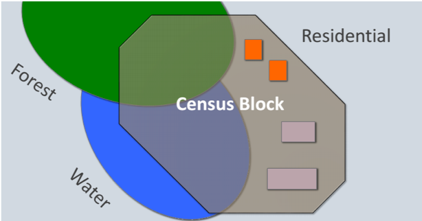
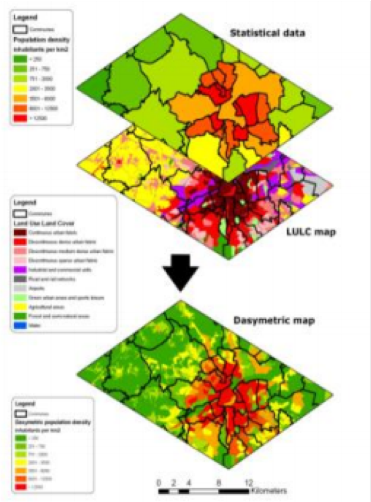
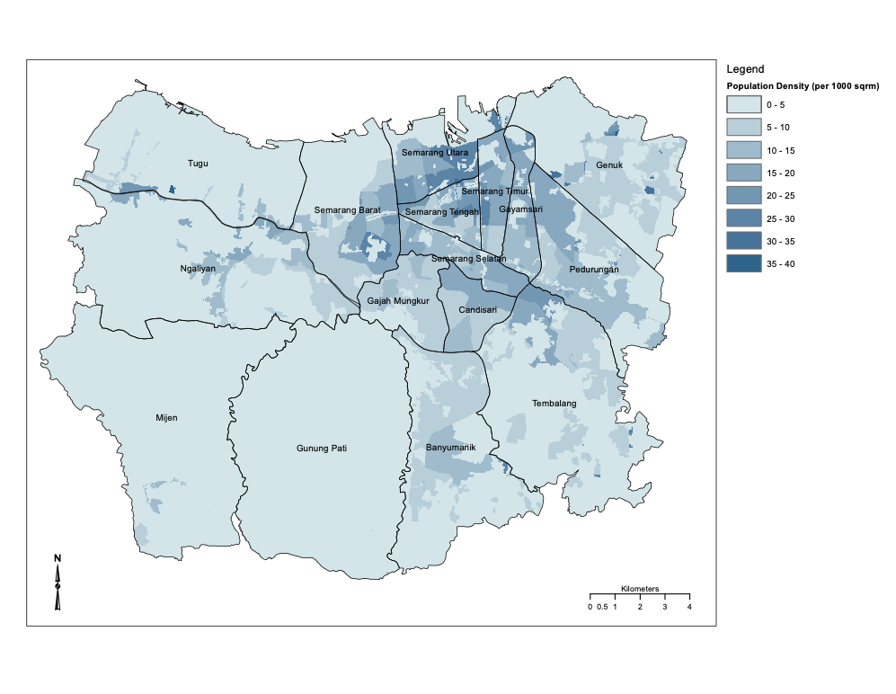

# Studi Kasus : Semarang Urban Growth and Access to Public Infrastructure 

Dalam studi kasus ini, kami memilih studi yang telah dilakukan oleh GeoInformatics Center - Asian Institute of Technology, Thailand, sebagai bagian dari proyek City Planning Labs yang didanai oleh Bank Dunia di Kota Semarang, Jawa Tengah.

Data yang diperlukan dapat diunduh di https://www.dropbox.com/sh/la6r01w4rabiype/AABk-rfe3iHELlDUT_CEUyl0a?dl=0.

Prediksi tataguna lahan dilakukan dengan menggunakan MOLUSCE, sebuah plugin QGIS 2. Perangkat lunak QGIS dapat diunduh di tautan berikut http://download.osgeo.org/qgis/win64/QGIS-OSGeo4W-2.14.21-1-Setup-x86_64.exe.

Analisis akses fasilitas public dilakukan dengan menggunakan tool Service Area Analyses di QGIS 3. Perangkat lunak QGIS 3.4 LTR (Long Term Release) dapat diunduh di tautan berikut https://qgis.org/downloads/QGIS-OSGeo4W-3.4.14-1-Setup-x86_64.exe

## Pertumbuhan Wilayah Kota (Urban Growth)

## Prediksi Tataguna Lahan

## Dasymetric Mapping

Sensus penduduk merupakan sumber utama data populasi Indonesia dan informasi populasi tersebut ditautkan dalam unit spasial administrasi, misalnya desa, blok sensus dan sebagainya.

(\#fig:unnamed-chunk-1)Blok sensus dan tutupan lahan

Data sensus menyediakan ringkasan pola demografis, namun ia tidak memberikan informasi spesifik mengenai apa di mana, yang diperlukan untuk analisis spasial.

(\#fig:unnamed-chunk-2)Perbandingan data penduduk dalam format vektor dan raster

Data sensus dapat didistribusikan berdasarkan tutupan lahan / penggunaan lahan, yang disebut dengan Dasymetric Mapping, menautkan atribut kelas tutupan lahan dengan bobot populasi dan mendistribusikan populasi ke setiap kelas tutupan lahan secara proporsional, dengan bobot tertentu.

(\#fig:unnamed-chunk-3)Dasymetric mapping

Berikut adalah distribusi penduduk Kota Semarang tahun 2011 dan 2014, hasil dari Dasymetric Mapping.

(\#fig:unnamed-chunk-4)Distribusi penduduk Kota Semarang Tahun 2011

(\#fig:unnamed-chunk-5)Distribusi penduduk Kota Semarang Tahun 2014

## Akses ke Fasilitas Publik 

